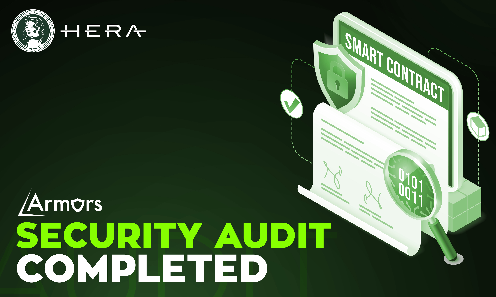

# Audits

Our smart contracts audited by **Armor Labs**.\
More details: [_https://armors.io/_](https://armors.io/)

### Hera Aggregator V2 Contracts 

Audit results: _**Pending**_

* HeraAggregatorV2 Contract ✅
* HeraExecutor Contract (self-reported) ✅
* HeraFeeSequencer Contract ✅

### &#x20;Hera Aggregator V1 Contracts

Audit results: PASSED

* Hera Aggregator Contract ✅
* Fee Organizer Contract ✅

**Check audit reports:**

Hera Aggregator Router: 0xAfCB0803F96dC1e9768d14ce55b1a46b26deb24c
\

Proof: [http://odex.vip/?sign=a3a99d09d0c20d4306da1ca6daf835b7](http://odex.vip/?sign=a3a99d09d0c20d4306da1ca6daf835b7)


Aggregator Router Contract


Hera Fee Organizer: 0xff2e95d887c426d724B3A873fe33D554A10f2fA5\

Proof: [http://odex.vip/?sign=8eba4e3e16e6e5a1fd8a7147c829d69e](http://odex.vip/?sign=8eba4e3e16e6e5a1fd8a7147c829d69e)


Fee Organizer _Contract_

