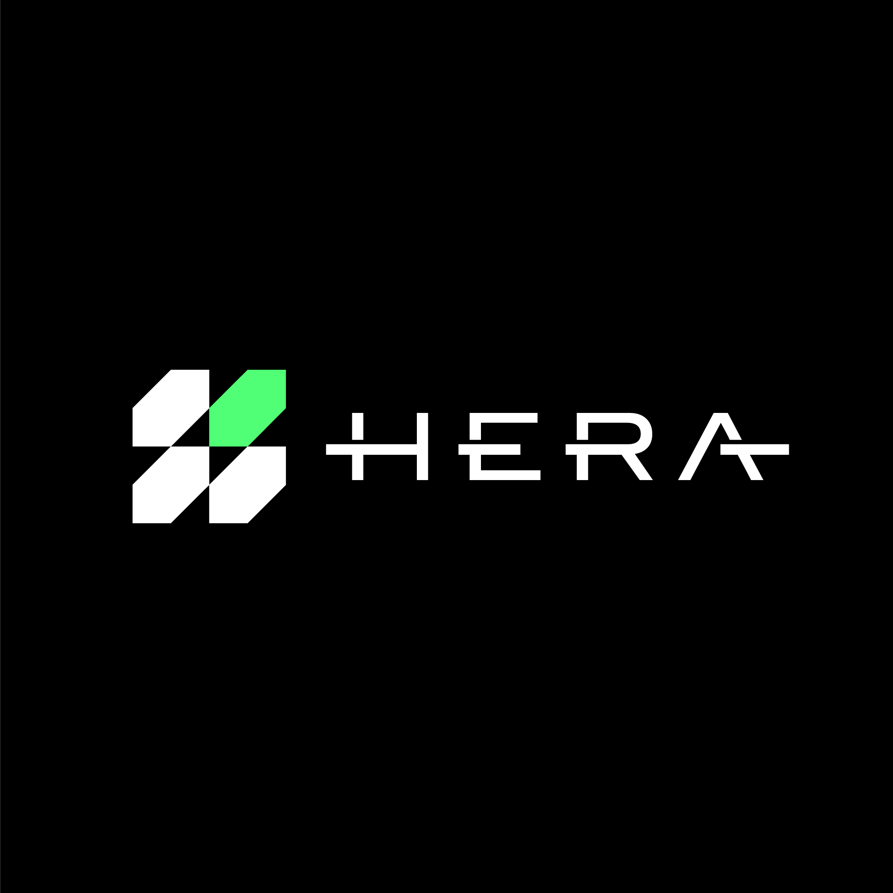
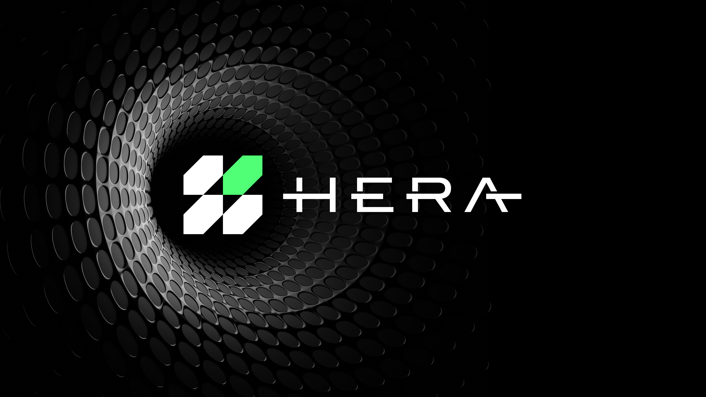
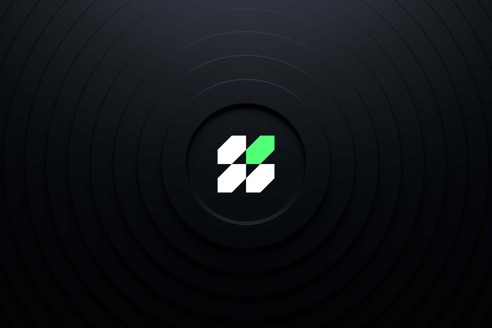
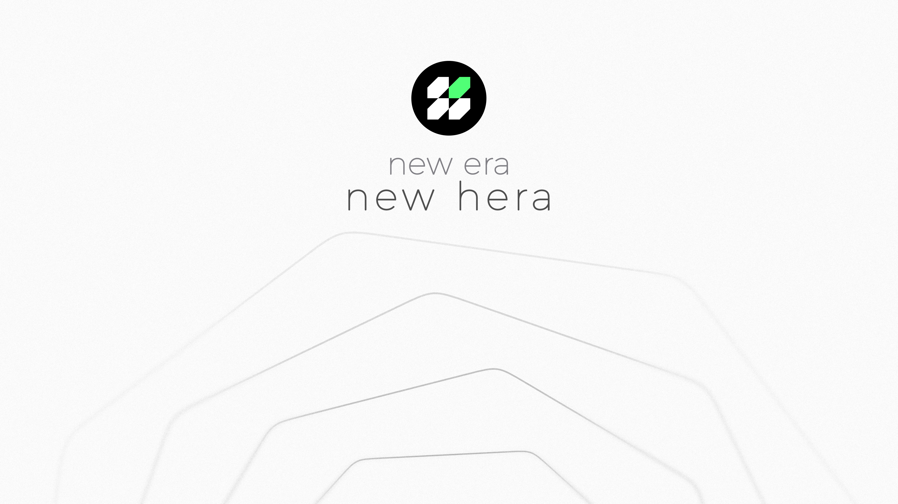
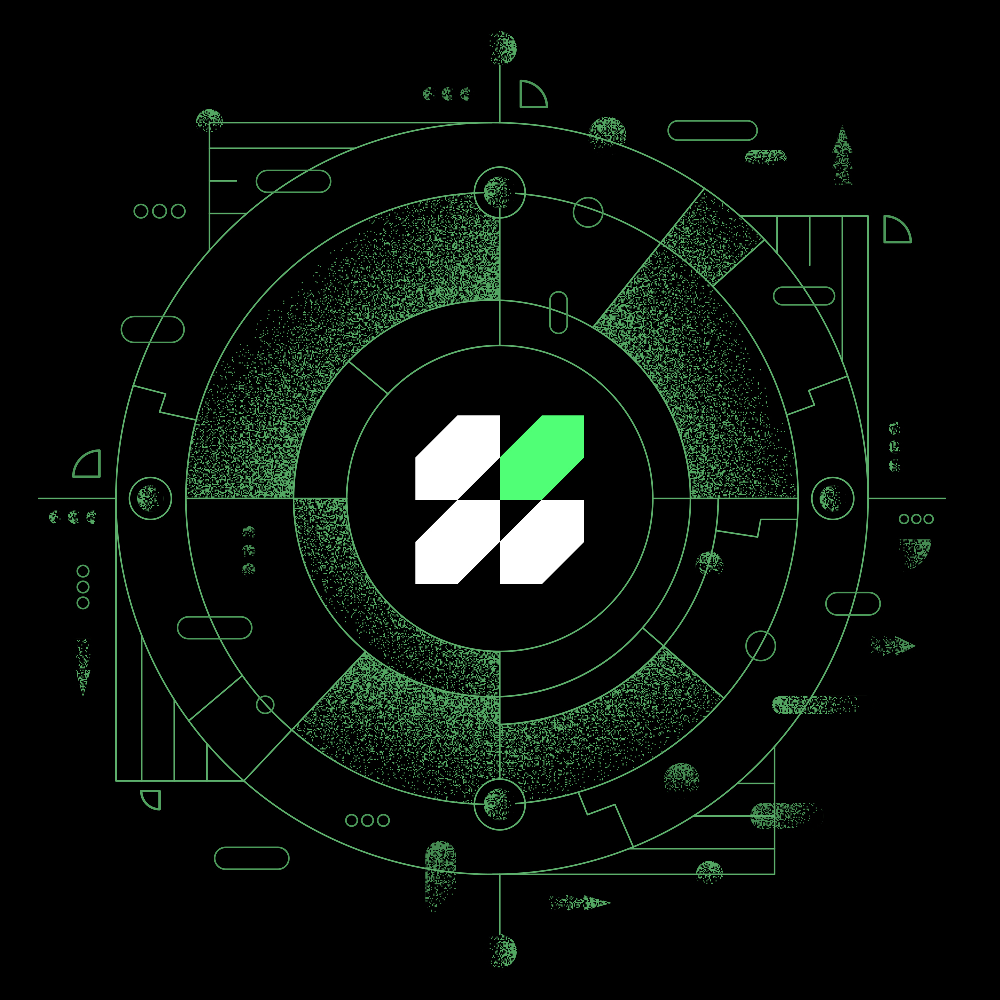
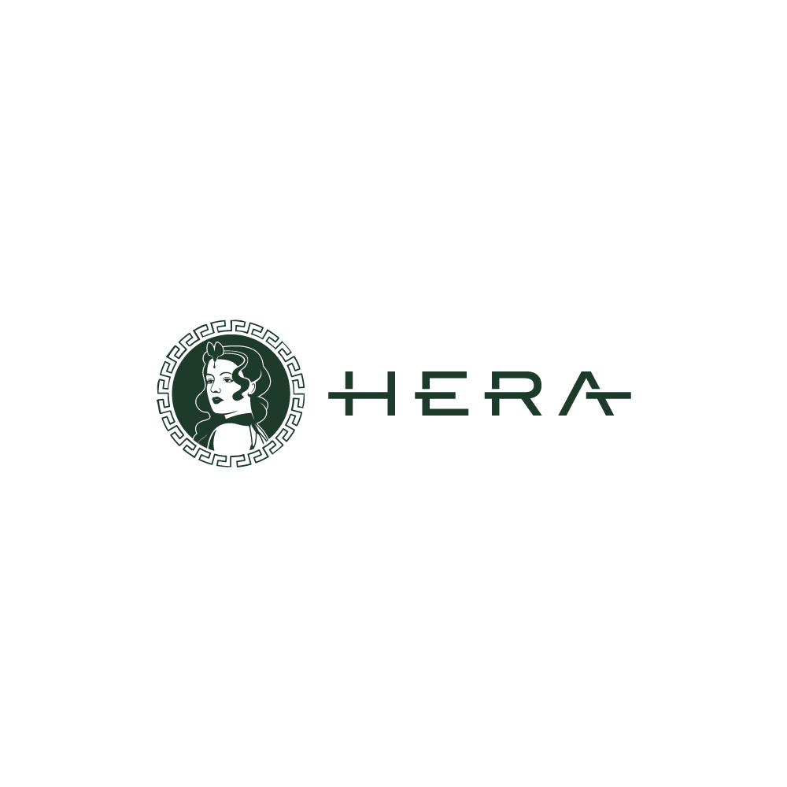
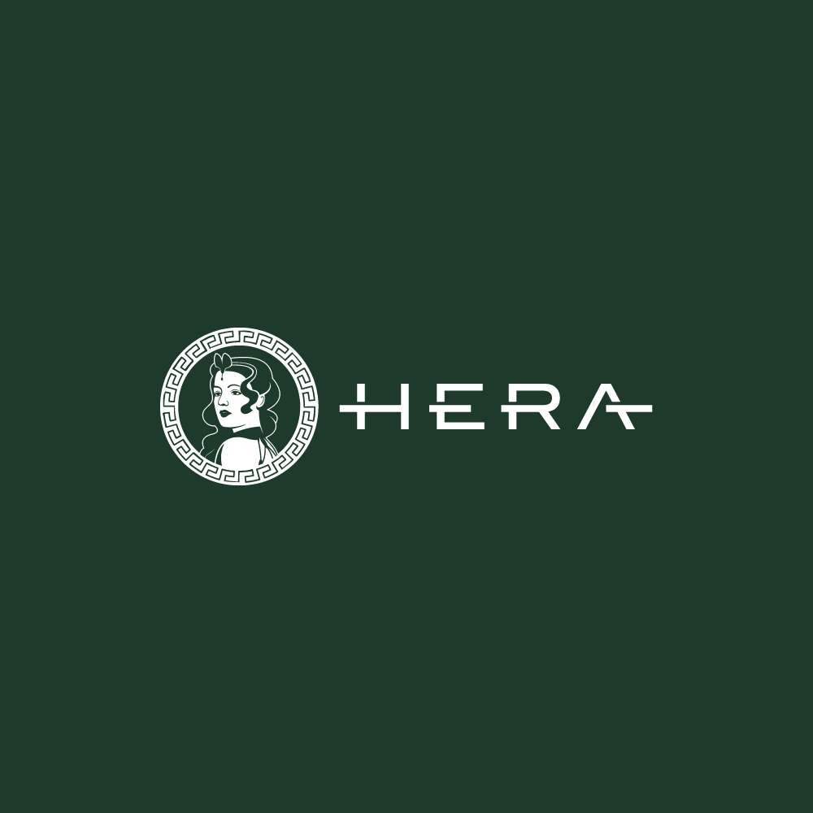
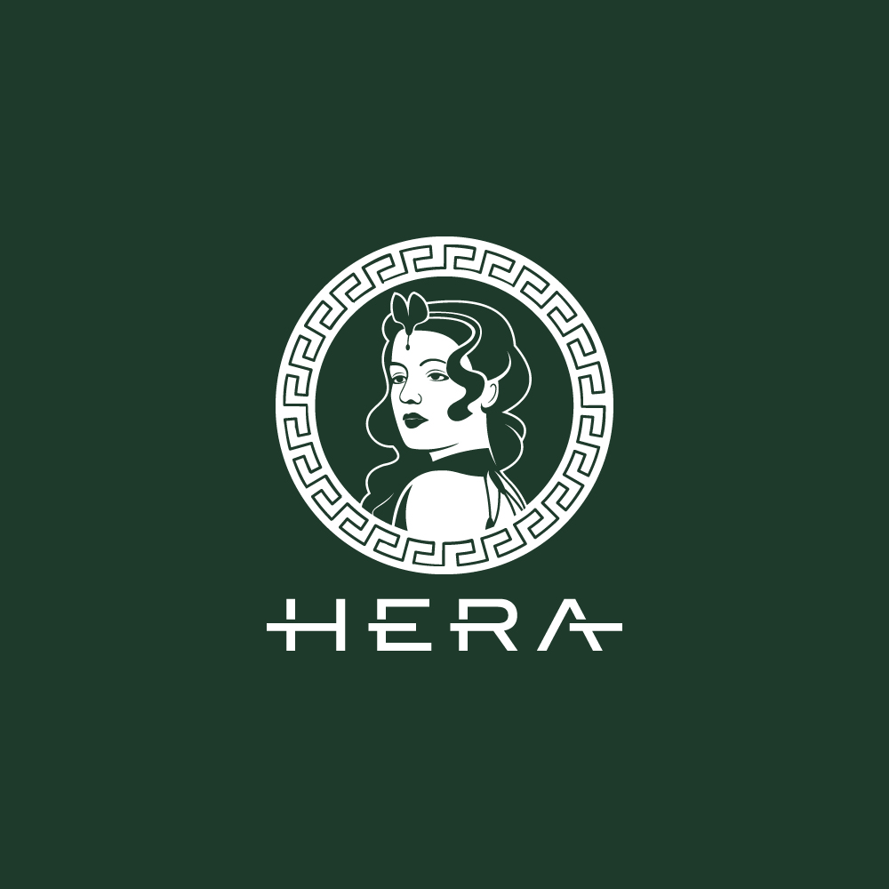

# Media Assets

## Hera Logo Assets

<figure><figcaption></figcaption></figure>

 

<figure><figcaption></figcaption></figure>

 

<figure><figcaption></figcaption></figure>

 

<figure><figcaption></figcaption></figure>

Download the branding package to directly access the logo versions and different file types.



## Hera Branding Assets

<figure><figcaption></figcaption></figure>

<figure><figcaption></figcaption></figure>

<figure><figcaption></figcaption></figure>

<figure><figcaption></figcaption></figure>

***

### Pre-July 2024 Logo

  

