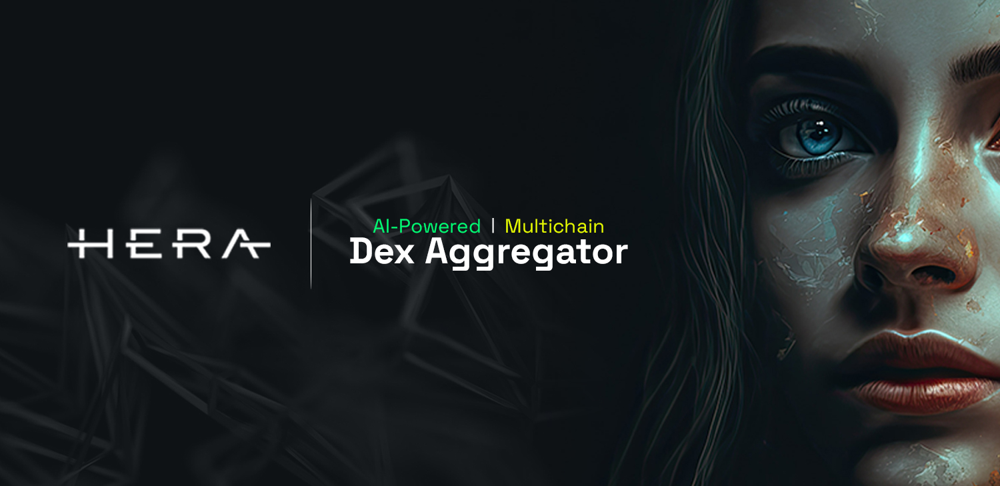
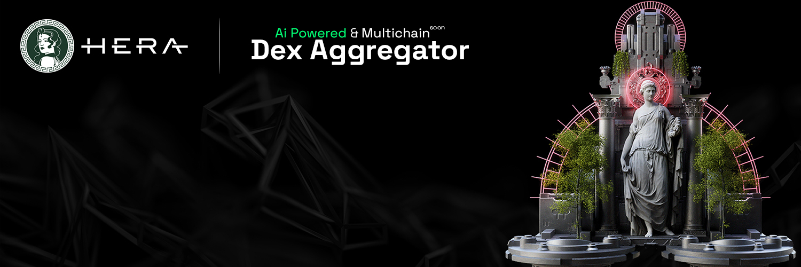
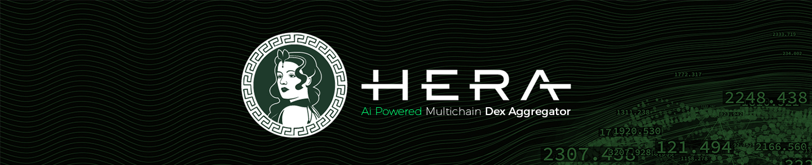

# Media Assets

  

<figure><figcaption></figcaption></figure>

.jpg>) .jpg>)

.jpg>)

.jpg>)

.jpg>)

.jpg>)

.jpg>)

<figure><figcaption></figcaption></figure>

<figure><figcaption></figcaption></figure>

<figure><figcaption></figcaption></figure>
