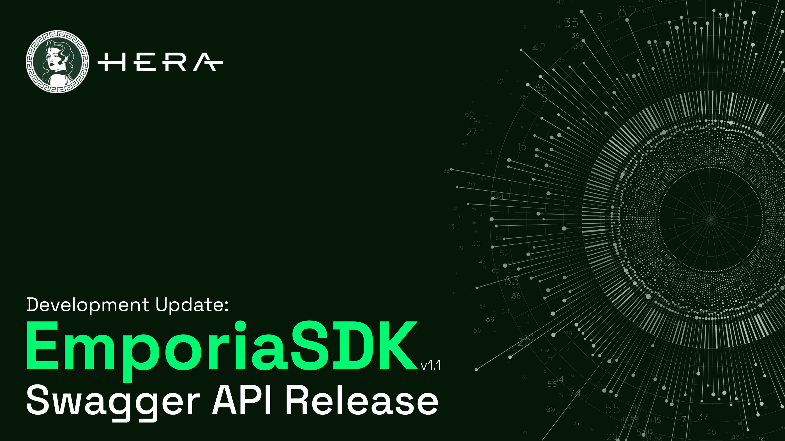

# Overview

<figure><figcaption></figcaption></figure>

Emporia got its name from Greek Mythology and means "the place where merchants traded."

EmporiaSDK is built on top of Hera Dex Aggregator and is recommended for developers or traders. Project developers can quickly incorporate Hera Aggregator into their ecosystem and start using it instantly.

Swagger API gives access to 3rd parties to find the best swap rate. This enables integrations to respond in the fastest way and streamline the process phase all the way to the point of being ready for swap. Some of the example paths are allowance, quote, and swap. Get started now to integrate easily!

> Get started now to integrate easily!&#x20;


[swagger-api.md](swagger-api.md)

