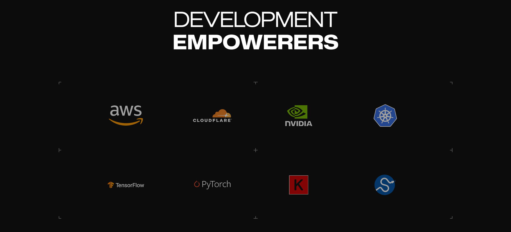

# Interoperability

### Connecting offchain power with onchain trustlessness.

> ```html
> unified execution, unlimited possibilities
> ```

Combining onchain trustless architecture with offchain computational power, Hera lays the foundation for the envisioned interoperability model. Hera core-pathfinder combines the power of CPU and GPU to process data offchain and send it onchain for execution.


The core protocol, consisting of a total of 12 different nodes, encompasses multiple languages and processing types. Different servers are deployed for computational tasks and AI management and training processes.


#### Execution and Sustainability

Today's blockchain technologies are not capable of handling complex transaction models alone and thus rely on the support of centralized protocols. Hera's core-pathfinder model and AI modules are run off-chain.

One of the ultimate goals is to package Hera's core pathfinder model so that it can be deployed by anyone in the future, contributing to its processing power. This way, the community can directly support or benefit from this technology.

<figure><figcaption></figcaption></figure>
