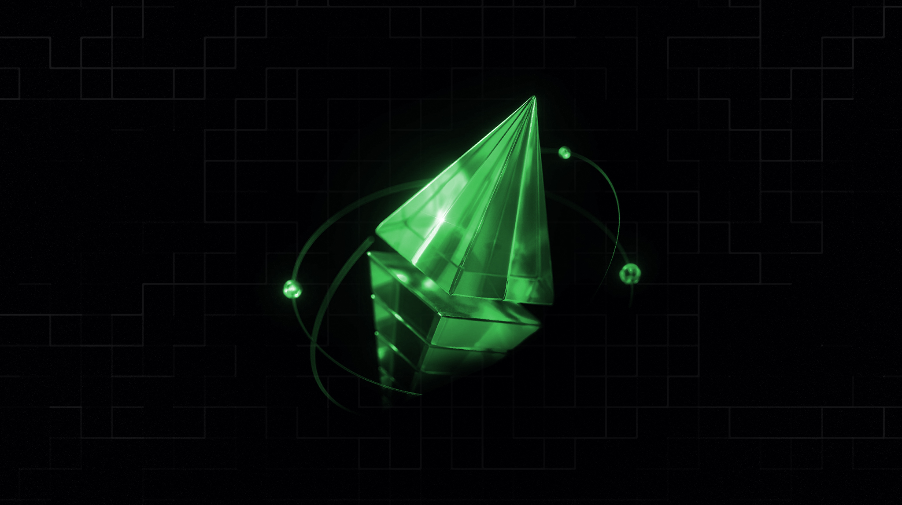

# Interchain

### One Route, All Liquidity

Hera's interchain technology enables access to all onchain liquidity through a single route. This is not just a need of today but a necessity for the future, and Hera's research team has been preparing for this extensively.

> Maximize your DeFi potential with Hera's innovative interchain solutions.

As numerous new Layer 1 and Layer 2 solutions emerge, liquidity is distributed across different chains. This has caused significant issues in swap performance. The solution lies in running cross-chain communication protocols and core-pathfinder modules together.

The primary goal of interchain technology is to aggregate liquidity from multiple chains into a single route. This requires well-designed cross-chain communication and asset transfer protocols, an area where Hera's R\&D team has been diligently preparing.

***

#### Universal Liquidity

Hera provides access to Ethereum, major Layer 1 chains, and many Layer 2 chains. It aggregates offers from market makers across these chains and compiles them for the best swap execution. This is the most comprehensive definition of liquidity access in the DeFi space.

#### Advanced Routing

Imagine a single route incorporating multiple chains and multiple AMMs. Now, elevate this concept where the route completes on the execution chain, utilizing liquidity from a Layer 1 and returning to the Layer 2 execution layer. The routing structure is fully user-controlled, allowing flexibility and optimization.

#### Communication Protocols

The cornerstone of the interchain model is efficient data transmission across chains. Technologies such as LayerZero, Wormhole, Chainlink, and Axelar are combined in a cumulative approach to achieve seamless cross-chain communication.

#### Asset Transfers

Achieving access to all liquidity through a single route requires robust cross-chain asset transfer protocols. Hera addresses this through two approaches: utilizing existing bridge protocols and designing a proprietary interchain assets bridge protocol, aiming for the maximum accessible bridge assets.



Hera Interchain is the primary goal following the V3 deployment. Once V3 is deployed across key chains, the interchain process will commence, enabling the core-pathfinder modules deployed on different chains to communicate via bridges and communication protocols.



A few years ago, the concept of cross-chain interoperability was hardly discussed. Today, we see tokens on multiple chains, symbolizing an inevitable convergence. The Hera team is committed to building a central swap protocol for DeFi, ensuring compatibility and sustainability across various blockchain networks.


