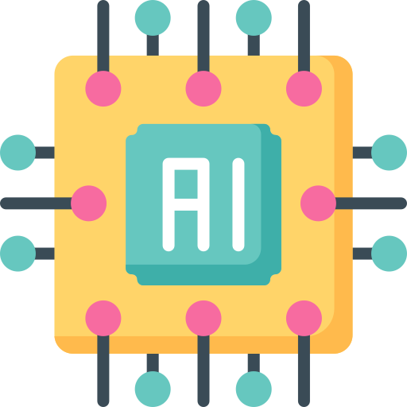
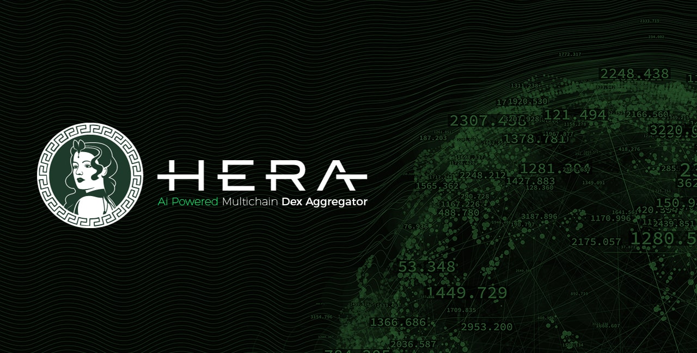

# AI Powered Pathfinder

#### Find the best route with | Ai Powered  Pathfinder

Hera Aggregator is built on a unique architecture with a pathfinder algorithm. Our unique algorithm's structure can be developed, re-programmed, and has self-learning capabilities.

### **Pathfinder Structure:**&#x20;

#### 01. Max Output Equation

A mathematical equation is created to get the maximum output from the integrated liquidity providers. The result of this equation gives the best received amount.

It creates an equation in accordance with the pathfinder route finding structure by controlling all liquidity pools. This equation is not fixed, it changes itself according to the terms and conditions. Therefore, it uses many data types as input.

#### 02. HCA Data Processing

All required data is instantly accessed and converted to High Conversion Argument (HCA). This converted data is sent to the max output equation.

The data needed to solve the equation are provided. It is then finalized using the HCA module powered by artificial intelligence. It is then forwarded to the next step to find the max output figure.

#### 03. Find All Paths

It searches and finds all possible routes between two tokens and filters out unnecessary routes by filtering within certain criteria.

Pathfinder, which is prepared to take a maximum of 5 tokens between the input token and the output token, performs a filtering to reduce the almost infinite number of outputs. It eliminates very low liquidity pools, identifies tokens that can be matched between them, and prepares them to offer a multiple path.

#### 04. Hera Pathfinder: Assemble&#x20;

All obtained data and formulas are sent to AI powered pathfinder algorithm.

All data is assembled at this stage. After many calculations and formula analysis, it brings together the scattered data and creates the data needed to confirm the swap transaction.

### Capacity and Development Qualifications



* AMM Integrations
* Data Filter
* Scaning Features
* Pathfinding Methods
* Liquidity Splitting
* Route Splitting
* Task Distributions
* Workload Reduction
* Route Optimization
* Algorithm Update



* Fee Rates
* Liquidity Reserves
* Token Details
* Calculation Algorithms
* Route Rules
* Calldata Attributes
* Input/Output Amount Controller



* Route Finding
* Using Previously Routes
* Defining Liquidity Quality


