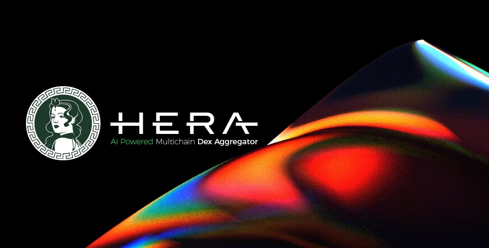

# Utility Token

Hera Token is the governance token of Hera ecosystem. Asides from voting, the token is used in many other areas in the ecosystem.

### Utility Areas

#### 01. Buy-Back Progress

In certain periods Hera tokens are purchased from the market at the rate determined by the platform's revenue and VaultManager's recommendations. This is used to add liquidity on AMMs and exchanges, transfer to the market-maker wallet, or sent to Staking Portal as a reward to participants.

#### 02. Stake and Earn

More Hera Tokens can be earned by staking your tokens or LP tokens. These rewards are funded by protocol revenues. Therefore, APY rates are variable.



#### 03. Swap Fee Reduce (soon)

Aggregator platform charges a fee for swap transactions. The current rate is 0.3% from input token. For people who stake Hera Token, swap fee rate decreases gradually according to the stake amount and HeraPower.

#### 04. Hera DAO & Governance (soon)

Proposals will be submitted to the community to make decisions concerning the platform. Hera Token holders have voting rights. Studies on a fair management structure continue.
