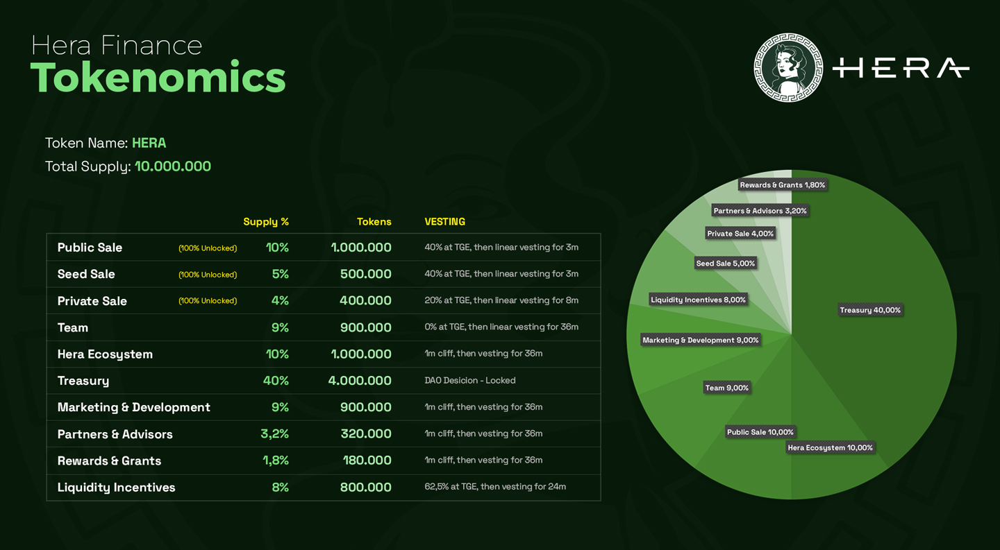
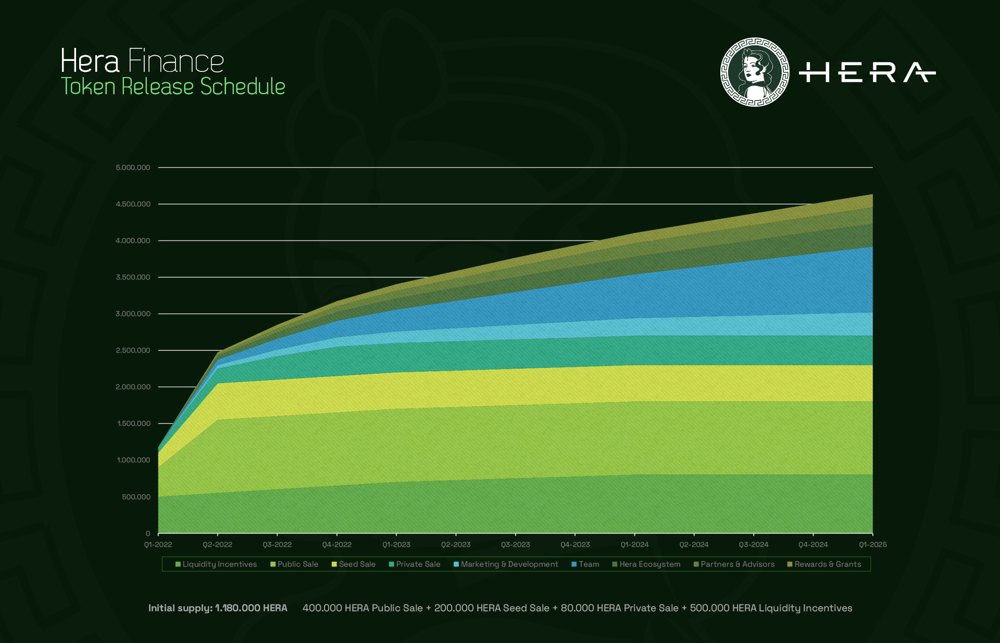
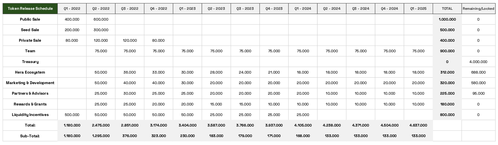

# Tokenomics

#### Our Tokenomics and Vesting Details 

| Tokenomics              | Supply % |   Tokens   | Vesting                                      |
| ----------------------- | :------: | :--------: | -------------------------------------------- |
| Public Sale             |  10,00%  |  1.000.000 | 40% at TGE, then linear vesting for 3 months |
| Seed Sale               |   5,00%  |   500.000  | 40% at TGE, then linear vesting for 3 months |
| Private Sale            |   4,00%  |   400.000  | 20% at TGE, then linear vesting for 8 months |
| Team                    |   9,00%  |   900.000  | 0% at TGE, then linear vesting for 36 months |
| Hera Ecosystem          |  10,00%  |  1.000.000 | 1m cliff, then vesting for 36m               |
| Treasury                |  40,00%  |  4.000.000 | DAO Desicion - Locked                        |
| Marketing & Development |   9,00%  |   900.000  | 1m cliff, then vesting for 36m               |
| Partners & Advisors     |   3,20%  |   320.000  | 1m cliff, then vesting for 36m               |
| Rewards & Grants        |   1,80%  |   180.000  | 1m cliff, then vesting for 36m               |
| Liquidity Incentives    |   8,00%  |   800.000  | 62,5% at TGE, then vesting for 24m           |
| Total:                  |  100,00% | 10.000.000 |                                              |

####

#### Token Release Schedule

#### Token Release Schedule

