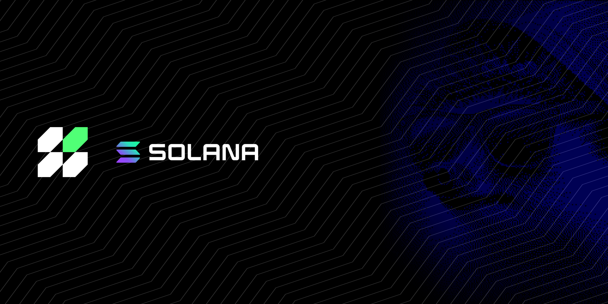

# Overview

<figure><figcaption></figcaption></figure>

The Hera core team, with full support from the community, decided to launch the V3 release on Solana before rolling it out across EVMs, and this process officially began in September 2025.

The Solana version will run directly on **hera.ag**, and all documentation and details will continue to be published there. Under this menu, you’ll find everything from contract information and product details to API routes and other useful resources.
